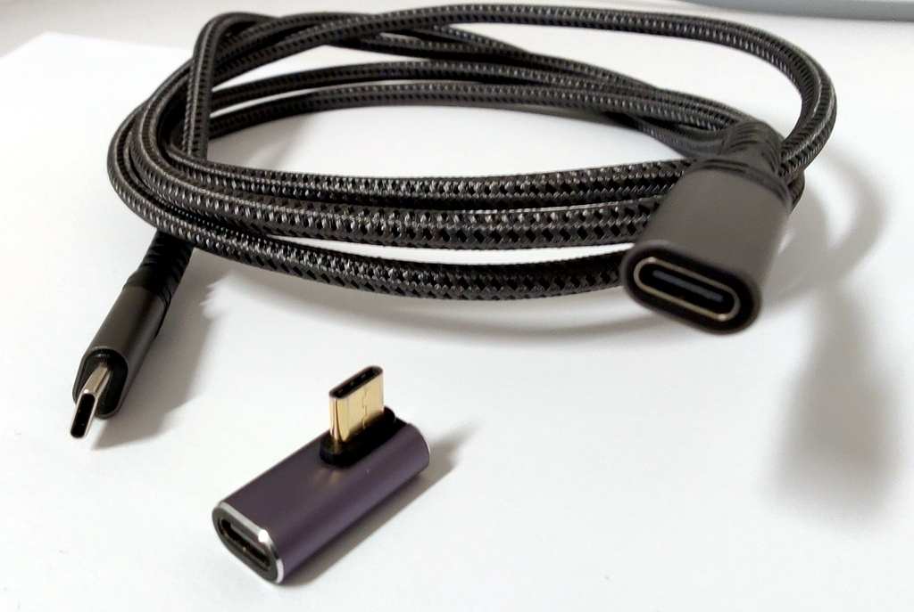
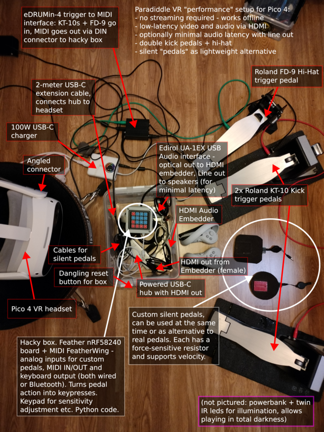

# :drum: Paradiddle VR "FAQ"

This is mostly a collection of information that should answer some commonly asked questions in the Paradiddle Discord, especially related to using MIDI and foot pedals.

*Disclaimer: This is an unofficial reference provided for informational purposes only, and does not replace official documentation of Paradiddle. The author makes no guarantees regarding the accuracy, completeness, or usefulness of the information contained herein and assumes no responsibility for any consequences resulting from its use. Use at your own risk.*

## :electric_plug: Handy accessories

- Good 2-meter USB-C extension cable - connect just this to the headset to avoid dangling cables restricting movement

- Powered USB-C hub - connect to extension cable and plug in any peripherals, charges the headset while playing
  - Make sure it's a _quality_ one that supports USB-C Power Delivery with decent wattage (45W+)

- Infrared illuminator to improve tracking quality in uneven lighting, and to allow playing in complete darkness
  - Search online for "Quest IR illuminator" or such, it doesn't matter that much what it is, as long as it has IR leds that illuminate a relatively wide area


## :saxophone: Songs

[Official Custom Song Guide](https://paradiddleapp.com/custom-song-guide/)

"Songs", also referred to as maps, consist of at least one audio file and one `.rlrr` file. The `.rlrr` is just a JSON definition of the song metadata, the filenames the song consists of (audio files, cover art), a kit definition (`instruments`), including the positions, pitch and other settings of individual kit pieces, plus events within the song that show up on the note highway.

### :performing_arts: Custom songs

[paraDB](https://paradb.net/) hosts custom songs for download, see [instructions](https://paradb.net/instructions) on how to extract the files correctly, also described below.

### :open_file_folder: Song directory layout

`Songs` is a subdirectory in Paradiddle's game directory. On standalone headsets such as the Quest, this would be `Paradiddle/Songs` at the root of its "Internal Shared Storage". Each **Song** is a subdirectory in the `Songs` directory. All files must be extracted, ie. not in a .zip.

```
Songs/
├── Thoughts and Prayers
│   ├── Disguise.png
│   ├── guitar.ogg
│   └── Thoughts and Prayers_Expert.rlrr
├── Thriller
│   ├── album.jpg
│   ├── song.ogg
│   ├── Thriller_Easy.rlrr
│   ├── Thriller_Expert.rlrr
│   ├── Thriller_Hard.rlrr
│   └── Thriller_Medium.rlrr
...
```

In the above directory listing, "Thoughts and Prayers" has only one difficulty, "Thriller" has all four. Many manually mapped custom songs only include the Expert level, which is usually the most accurate representation of the song the mapper did. Songs converted from other rhythm games often have more simplified levels, but can also be of poor quality in terms of accuracy, timing and instruments, unless adjusted or fixed after conversion.

There can be one or more audio files and up to four drum audio files.

> [!TIP]
> The `.rlrr` files are human-readable JSON and you can just mess with them with a text editor such as Notepad, or generate them entirely with code.

## :musical_score: MIDI

[Official MIDI guide](https://paradiddleapp.com/midi-guide/)

There's two main ways Paradiddle can utilize MIDI:
1. **MIDI input** - play the VR kit pieces using an e-kit, or any other device with MIDI support
2. **MIDI output** - send midi to another device by playing the VR kit pieces in Paradiddle

- If you want to use an electronic drum kit with Paradiddle, you want **MIDI input**.
- If you want to control a synthesizer or such by playing the VR kit, you want **MIDI output**.
- You can also do both (play VR sounds with external device while using VR kit to play some other device).

### :open_book: Essential MIDI basics

- [MIDI](https://en.wikipedia.org/wiki/MIDI) is a standard for communications between electronic musical instruments
- MIDI is digital data (not a "signal") for musical events, such as which note was played, how hard, and for how long
- There are 16 "channels" for communications, which the sender and receiver need configured to match
  - If device A sends to channel 10 and device B listens to channel 10, device B gets the message
  - If device A sends to channel 10 and device B listens to channel 4, device B does not get the message
  - A device could also be listening to more than one, or all channels (sometimes option "0" with channels numbered 1-16), and also send events to more than one channel at a time, depending on the device's features
- MIDI channel 10 is reserved for percussion in the [General MIDI standard](https://en.wikipedia.org/wiki/General_MIDI), which means that different percussion sounds should be triggered with the notes received, instead of pitching the current instrument
  - Most electronic drum kits output on channel 10, sometimes this can be changed too

### :arrows_counterclockwise: MIDI connections

There's two common ways for wired MIDI connections:

#### USB MIDI (typical)

MIDI can be used over USB by connecting the e-kit's USB-B port to a USB-A port (of a PC or an OTG adapter/hub) using a "printer cable", which has the plugs for both.

When choosing a cable to use, consider the length and type of connector, and overall tidiness - there are USB-C <-> USB-B cables also available, but USB-A ones may be more readily available, cheap and versatile when coupled with an OTG adapter or hub. There are no high requirements for the cable as the standard MIDI bandwidth is only 31250 bits per second - as long as the data pins are connected and the cable is not decrepit, it's likely to be fine for the purpose. Still, bad cables or adapters occasionally cause erratic problems, so it's good to have more than one to try in case of issues.


#### MIDI via 5-pin DIN connectors (traditional, older kits)

A USB MIDI adapter is needed, some audio interfaces have MIDI ports which may also work


When using traditional 5-pin MIDI cables with a USB MIDI adapter, note that some adapters may have a switch with positions like "tab" / "comp", to change the operating mode of the adapter. The one that outputs standard USB MIDI should usually be selected - consult the adapter's manual.

> [!IMPORTANT]
> If using a standalone headset and your kit supports USB, ensure that it also supports _standard_ USB MIDI. If the kit requires a special driver to work with a computer, it's possible that it uses a proprietary protocol over USB, and **won't work on standalone headsets**.
> If such a kit has traditional MIDI ports, it can be used with a USB MIDI adapter.

### :arrow_left: :notes: MIDI input

#### :desktop_computer: PC/Steam

On the PC, just connect your device(s) via USB or otherwise - as long as Windows recognizes it as a MIDI device, it should work. Then:

- Pick the correct MIDI input device from Paradiddle's settings
- Ensure MIDI input is enabled for the kit pieces

To test and debug communications, a tool such as [MidiView](https://hautetechnique.com/midi/midiview/) may be useful to check that the kit outputs the expected MIDI notes on the expected channel.

#### :goggles: Standalone headsets - Quest, Pico, etc.

Quest/Pico/etc. have a USB-C port. To connect devices such as your kit to it, you need a [USB OTG adapter](https://en.wikipedia.org/wiki/USB_On-The-Go) which is typically a short cable with one USB-C male connector (plug to headset) and one USB-A female connector (plug your device here). There are also variants that have a third USB-C female connector for supplying power to the headset, keeping it charged while playing.

A USB-C hub works similarly to an OTG adapter but has more functionality.

Connect your kit/device to the OTG adapter or hub, then that to the headset. Then pick the available MIDI input device in Paradiddle's settings.

### :notes: :arrow_right: MIDI output (USB / network)

#### :desktop_computer: PC/Steam

On the PC, output is as simple as input - just pick the right MIDI output device in Paradiddle's settings.

#### :goggles: Standalone headsets - Quest, Pico, etc.

Using MIDI output on standalone headsets _requires_ running [ParadiddleUtilities](https://github.com/emretanirgan/ParadiddleUtilities) on a computer. It should run where Python runs, for example Windows, Linux and MacOS. You would then configure the MIDI routing on the computer.

ParadiddleUtilities, which also has a Song "creator" (not to be confused with [ParEdit](https://github.com/CANA-Dan/ParEdit), a much more extensive Song _editor_), has a "MIDI Connect" tab, where you can input the IP address of your headset to connect to it while Paradiddle is running.

After connecting to the headset, you can enable MIDI output in (each of) Paradiddle's drums and route it wherever you want, such as into a DAW or a synthesizer, making it an interesting and versatile input device for creating music. The MIDI events are transmitted over UDP from the headset to ParadiddleUtilities - ensure that the computer and headset are connected to the same local network.

## :mechanical_leg: Foot pedals

[Official Pedal guide](https://paradiddleapp.com/pedal-guide/)

To play the bass drum and/or hi-hat with foot pedals, there's some common options:

- USB footswitches
  - The cheap ($20-ish) off-the-shelf option, with lackluster feel
- MIDI (from e-kit / drum trigger interface)
  - Not so cheap (typically $150+), but can feel just as nice as you have money to spend

Less common options:

- Rockband pedals (PC only)
- DIY - build your own, can be as fancy or minimalist as you prefer

### :keyboard: USB footswitches

A typical USB footswitch (commonly also referred to as pedal) is essentially just a USB keyboard with one programmable key, and you can connect as many as you need to Paradiddle. They can be configured with the manufacturer's control software (some might be able to program a variety of footswitches) to emit keypresses, and this should be done in a particular way:

- **Kick: single-shot** - key is pressed and immediately released, regardless of foot position
- **Hi-Hat: hold** - key is pressed and released only after the foot is lifted

After choosing the key to use (Space, A, etc.) in the control software, map it in Paradiddle's control settings. On standalone headsets, avoid modifier keys such as Control or Shift, just use letters.

> [!IMPORTANT]
> On PC/Steam, the game window must be focused for it to get keyboard input! Another window such as SteamVR's popup can easily get in the way, making it seem like the pedal doesn't work.

### :money_with_wings: MIDI pedals

A typical pedal with MIDI interface is the one that's connected to an e-kit's drum module. There are also dedicated MIDI drum interfaces where for example just the pedals/triggers can be connected, instead of using the whole kit, which makes for a more compact VR setup.

In contrast to footswitches that are easy to interface, using actual pedals can be expensive, not just due to the cost of the pedals/triggers themselves, but also of the interfaces required to hook them up. Still, finding nice gear second-hand can be affordable too.


### :guitar: Rockband pedals

The Rockband pedal cannot be used with Quest, as it requires an audio input connection which it lacks (the 3.5mm port is output _only_), and the standalone application does not currently (July 2025) support audio input devices, so hooking up a USB audio interface in between does not help.

With PC, there are two options:
- MIDI via Rockband kit
- Audio input

See official pedal guide for more details.

### :nut_and_bolt: DIY (Do-It-Yourself)

If you have some basic technical skills, building your own solution to incorporate footwork into Paradiddle can be rewarding and fun, and possibly even inexpensive.

A typical example is an off-the-shelf or jerry-rigged actuation mechanism (ie. the "pedal") combined with a sensor/kickpad and a microcontroller that outputs USB MIDI.

Also, DIY can also mean modifying an off-the-shelf footswitch for example, for better ergonomics or feel.

An example of a setup using some custom software and hardware (click to view larger): [](img/pedals-1536px.png)


## :hourglass: Minimizing latency

For a comfortable experience, the latency in visuals and audio should be as small as possible. 

### Audio output

Using Bluetooth headphones can be more or less ruled out, as the time it takes for the sound to play after it was triggered has a considerable and unpredictable latency. There are low-latency headphones using a separate transmitter, but these tend to be pricier.

When using an e-kit, the most responsive option is to mute the VR kit and listen to drum sounds played by the e-kit itself, via speakers for example. The song audio from Paradiddle can be played via an AUX cable through the kit too, or listened to via the headset's speakers. Note offset may need to be adjusted in Paradiddle settings for the notes to line up as expected.

### Streaming, Virtual Desktop etc.

:construction_worker:

## :magic_wand: Miscellaneous tips and tricks

- You can use the PDF import to create (temporary) decorations to your surroundings - just create a PDF of your favorite picture and hang it next to your hi-hat, or build a roof with them.

## :bow: Image attributions

- Image: ["MIDI ports and cable"](https://commons.wikimedia.org/wiki/File:Midi_ports_and_cable.jpg) by [Inductiveload](https://commons.wikimedia.org/wiki/User:Inductiveload), public domain.
- Image: ["A-B USB Cable"](https://commons.wikimedia.org/wiki/File:A-B_Usb_Cable.jpg) by [Zátonyi Sándor](https://commons.wikimedia.org/wiki/User:Z%C3%A1tonyi_S%C3%A1ndor), licensed under [CC BY-SA 3.0](https://creativecommons.org/licenses/by-sa/3.0/).
- Image: ["USB-C Hubb 5 portar"](https://commons.wikimedia.org/wiki/File:USB-C_Hubb_5_portar.jpg) by [Jonatan Svensson Glad](https://commons.wikimedia.org/wiki/User:Jonatan_Svensson_Glad), licensed under [CC BY-SA 4.0](https://creativecommons.org/licenses/)_)

