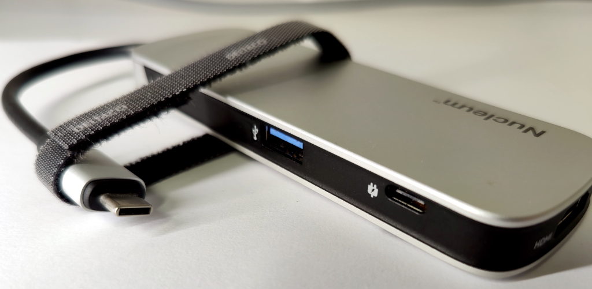
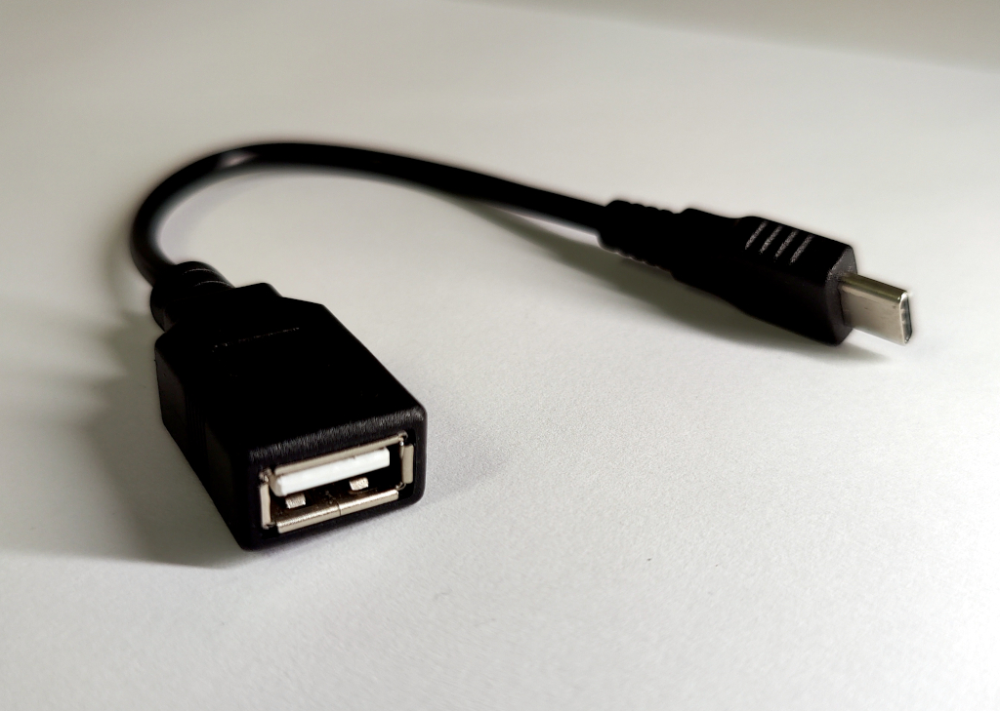
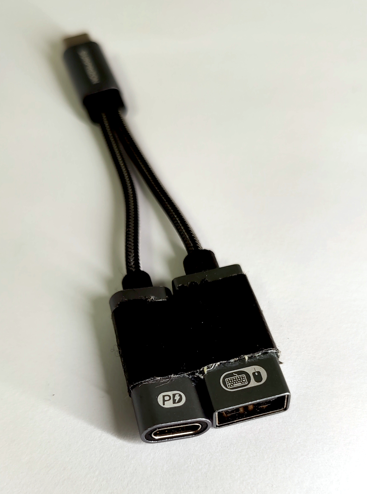
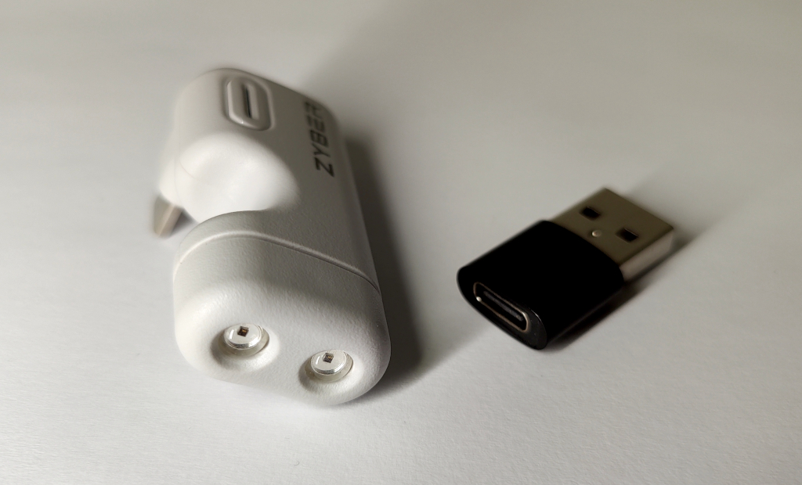
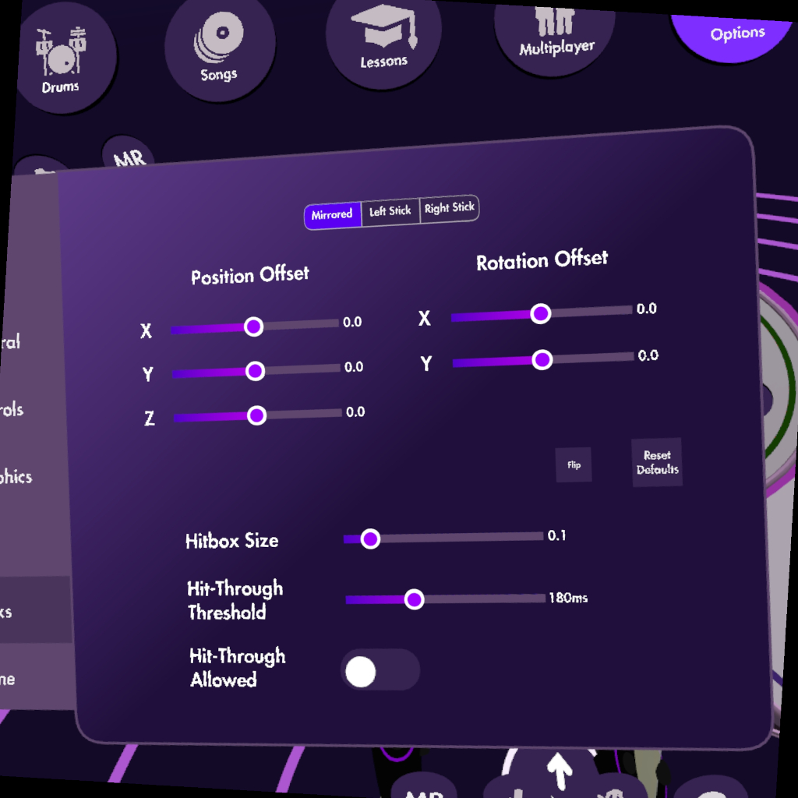
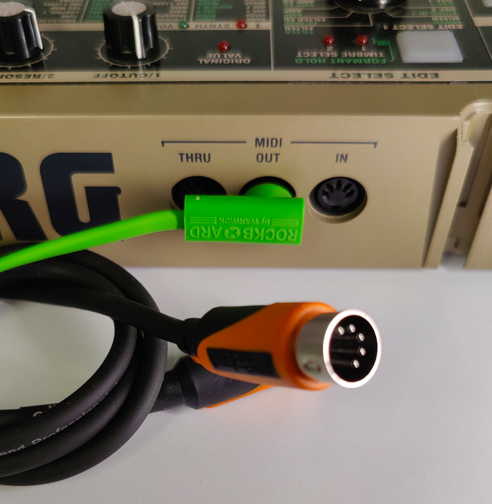
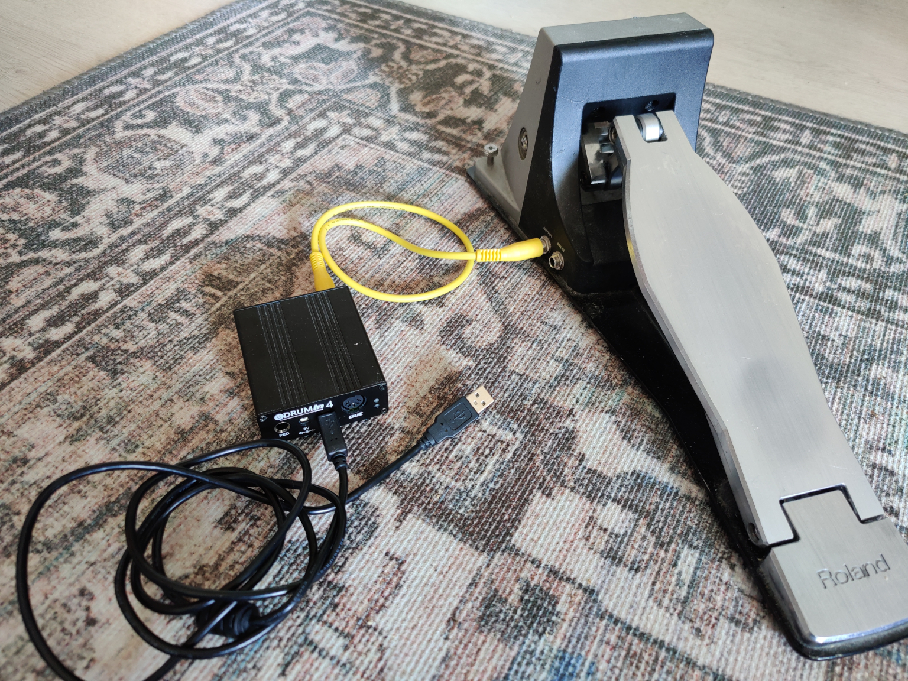

# :drum: Paradiddle VR "FAQ"

This is a collection of information about the VR drumming simulation / rhythm game [Paradiddle](https://paradiddleapp.com/) that should answer some commonly asked questions in the Paradiddle Discord, and allow easy linking to a particular section.

*Disclaimer: This is an unofficial reference provided for informational purposes only, and does not replace official documentation of Paradiddle. The author makes no guarantees regarding the accuracy, completeness, or usefulness of the information contained herein and assumes no responsibility for any consequences resulting from its use. Use at your own risk.*

## :electric_plug: Handy accessories

There's a variety of useful accessories to improve the playing experience.

USB-C powered hub | USB-C OTG adapter | USB-C OTG adapter with PD
:-:|:-:|:-:
 |  | 

USB-C extension cable and angled connector | Infrared Illuminator and USB-A <-> USB-C adapter | Controller grip straps (Pico 4)
:-:|:-:|:-:
 |  | 

### USB-C extension cable

Connect just this to the headset to avoid dangling cables restricting movement. The length can't be extended indefinitely, but for example a 2-meter one is practical enough and should work in most circumstances.

### Powered USB-C hub

Connect to extension cable and plug in any peripherals. If power is supplied to the hub (via a dedicated USB-C power port), it also charges the headset while playing. Make sure it's a _quality_ one that supports USB-C Power Delivery with decent wattage (45W+).

Using a hub gives the most flexibility and usually enough ports to connect all the pedals you might ever need.

### USB OTG adapter

Without a hub, the minimum needed to connect USB devices to standalone headsets.

Some adapters have a separate power port, a USB-C charger should be connected to it to charge the headset. This would also power any connected peripherals.

Make sure you get an adapter that explicitly mentions supporting Power Delivery (PD) and OTG.

### Infrared Illuminator

Using an IR light to illuminate the surroundings and controllers can improve tracking quality in uneven lighting, and allows playing in complete darkness.

Search online for "Quest IR illuminator" or such, it doesn't matter that much what it is, as long as it has IR leds that illuminate a relatively wide area. These can either be attached to the headset or simply pointed at the player from a distance, powered by a power bank.

---

## :medical_symbol: Posture and ergonomics

The sensation of playing a drum kit in VR is unlike playing a real one due to lack of rebound. This means that the player's hands must perform the entire motion of the virtual stick, including it "bouncing back" from the drum. Rolls that might require negligible energy to perform on a real kit, can be exhausting and awkward in VR unless proper technique is used.

You'll also need enough space to swing your hands, to not hurt others or break something.

Beginner players may quickly feel the strain in their wrists, and playing Paradiddle can be intense, but very fun exercise overall. It's important to avoid injuries by resting adequately and having a comfortable playing position, aligned with the virtual kit. For the choice of drum throne and sitting position, normal drumming ergonomics advice applies - avoid tension, be relaxed. Sit high enough so that you don't hit your legs with the controllers.

When playing with hand controllers, using grip straps is **a must**. Silicone or plastic might not withstand gameplay, consider ones that are solidly attached to the controllers. The straps allow you to relax your grip without dropping the controller, and gives more flexibility for hand movement.

Try to place the kit so that you can play the hi-hat and the most used drums as relaxed as possible. Being free from any restrictions of real hardware, feel free to position the kit pieces to **where they're comfortable to play**, not where they normally "should" go. Move your hands around in the air and feel what might work for you, and which hand orientation you'd rather use to hit a particular drum. Try to position the pieces fairly low, so that you don't need to keep your hands raised all the time, and keep in mind that you can always position anything on the fly to make a song more comfortable to play.

Consider how you want to play the hi-hat. If you already play drums, you might have a preference, but in VR controller tracking may benefit from playing "open-handed" (left hand playing the hi-hat), as the hands don't cross and occlude each other. This also allows placing the hi-hat fairly low, which helps to keep shoulders relaxed when playing fast.

When you've set up the kit as you like, remember to save it, and keep iterating it until it feels natural. Even small adjustments in snare or cymbal heights for example can potentially turn pain into comfort with songs that require rapid hits. The angle of the pieces should also be considered. For example a rotating, slightly sideways motion of the wrist during a hit can feel comfortable, but for accurate hits the drums might need to be aligned a bit.

Paradiddle has stick settings where you can adjust the stick hitbox size. Setting it to a low value makes only the tip of the stick collide with the drums, which helps to avoid accidentally hitting neighbouring pieces.

Paradiddle stick settings menu
:-:


> [!WARNING]
> Until your body adjusts to the motions necessary to play the VR kit, you will waste energy working against your own muscles and get exhausted. This is normal. If you start feeling pain, stop. You'll find that regular practice, along with good sleep, will gradually improve precision and endurance, and lessens the likelihood of injury.

---

## :saxophone: Songs

[Official Custom Song Guide](https://paradiddleapp.com/custom-song-guide/)

"Songs", also referred to as maps, consist of at least one audio file and at least one `.rlrr` file. The `.rlrr` files are named according to the difficulty level, for example `Ghostbusters_Expert.rlrr`.

Each `.rlrr` is just a [JSON](https://en.wikipedia.org/wiki/JSON#Syntax) definition of the song metadata, the filenames the song consists of (audio files, cover art), a kit definition (`instruments`), including the positions, pitch and other settings of individual kit pieces that would load with the song, plus events within the song that show up on the note highway, similar to notes in a MIDI file.

### :performing_arts: Custom songs

[paraDB](https://paradb.net/) hosts custom songs for download, and is currently the only such site for Paradiddle. See [instructions](https://paradb.net/instructions) on how to extract the files correctly, also described below.

#### :headphones: ParEdit

[ParEdit](https://github.com/CANA-Dan/ParEdit) is a Song _editor_ with features much beyond ParadiddleUtilities, and allows creating maps from scratch and editing them interactively in 3D.

#### :snake: ParadiddleUtilities

The official [ParadiddleUtilities](https://github.com/emretanirgan/ParadiddleUtilities) has a Song "creator", which requires:

- audio file(s)
- MIDI file for drum events, ie. the actual notes
- MIDI mapping that tells which note value in the MIDI file corresponds to which drum in Paradiddle

ParadiddleUtilities includes some MIDI mappings, these can be edited as needed:

```
ParadiddleUtilities
├── PDUtilities
│   │   ├── midi_maps
│   │   │   ├── midi_mapping.yaml
│   │   │   ├── pdtracks_mapping.yaml
│   │   │   ├── rhythm_ game_mapping_gh.yaml
│   │   │   └── rhythm_ game_mapping.yaml
```

Getting the MIDI mapping right can sometimes be frustrating. It's useful to confirm what note data the MIDI file actually contains using a MIDI editor or CLI utilities. Ensure that the notes are at least on the right track and preferably channel - 10 - but also note that channel numbering could be displayed as 0-15 instead of 1-16 depending on the software. It's always the 10th channel.

MIDI files contain one or more tracks - these are not quite like channels, but groups of MIDI events instead. When trying to use a random MIDI file, the drum parts could be anything depending on how the file was intended to be played back.

ParadiddleUtilities asks for the track to use. There's always at least one track in a MIDI file, but there can be more. Check this with a MIDI editor - percussion parts could be split into multiple tracks for example, complicating matters.

### :open_file_folder: Song directory layout

`Songs` is a subdirectory in Paradiddle's game directory. On standalone headsets such as the Quest, this would be `Paradiddle/Songs` at the root of its "Internal Shared Storage". Each **Song** is a subdirectory in the `Songs` directory. All files must be extracted, ie. not in a .zip.

```
Songs/
├── Thoughts and Prayers
│   ├── Disguise.png
│   ├── guitar.ogg
│   └── Thoughts and Prayers_Expert.rlrr
├── Thriller
│   ├── album.jpg
│   ├── song.ogg
│   ├── Thriller_Easy.rlrr
│   ├── Thriller_Expert.rlrr
│   ├── Thriller_Hard.rlrr
│   └── Thriller_Medium.rlrr
...
```

In the above directory listing, "Thoughts and Prayers" has only one difficulty, "Thriller" has all four. Many manually mapped custom songs only include the Expert level, which is usually the most accurate representation of the song the mapper did. Songs converted from other rhythm games often have more simplified levels, but can also be of poor quality in terms of accuracy, timing and instruments, unless adjusted or fixed after conversion.

There can be one or more audio files and up to four drum audio files. If a song has multiple drum tracks, the game can mute a more granular selection of them after a miss (?). See the official Custom Song Guide for details.

> [!TIP]
> The `.rlrr` files are human-readable JSON and you can just mess with them with a text editor such as Notepad, or generate them entirely with code.

---

## :musical_score: MIDI

[Official MIDI guide](https://paradiddleapp.com/midi-guide/)

There's two main ways Paradiddle can utilize MIDI:
1. **MIDI input** - play the VR kit pieces using an e-kit, or any other device with MIDI support
2. **MIDI output** - send midi to another device by playing the VR kit pieces in Paradiddle

- If you want to use an electronic drum kit with Paradiddle, you want **MIDI input**
- If you want to control a synthesizer or such by playing the VR kit, you want **MIDI output**
- You can also do both (play VR sounds with external device while using VR kit to play some other device)

### :open_book: Essential MIDI basics

- [MIDI](https://en.wikipedia.org/wiki/MIDI) is a standard for communications between electronic musical instruments
- MIDI is digital data (not a "signal") for musical events, such as which note was played, how hard, and for how long
- There are 16 "channels" for communications, which the sender and receiver need configured to match
  - If device A sends to channel 10 and device B listens to channel 10, device B gets the message
  - If device A sends to channel 10 and device B listens to channel 4, device B does not get the message
  - A device could also be listening to more than one, or all channels (sometimes option "0" with channels numbered 1-16), and also send events to more than one channel at a time, depending on the device's features
- MIDI channel 10 is reserved for percussion in the [General MIDI standard](https://en.wikipedia.org/wiki/General_MIDI), which means that different percussion sounds should be triggered with the notes received, instead of pitching the current instrument
  - Most electronic drum kits output on channel 10, sometimes this can be changed too

### Paradiddle MIDI configuration

- To use MIDI input or output, first pick the correct device(s) in Paradiddle's menu, in Options -> MIDI
- Then, enable either MIDI input or output **for each of the kit pieces** - just picking the MIDI device does not automatically toggle them on
- When MIDI output is enabled, in-game audio of that drum is muted automatically, but it can be toggled back on in the Audio tab of its settings

### :arrows_counterclockwise: Physical MIDI connections

There's two common ways for wired MIDI connections: using USB MIDI or traditional 5-pin MIDI ports.

USB-B "printer" cable | 5-pin MIDI ports and cable
:-:|:-:
 | 

#### USB MIDI (typical)

MIDI can be used over USB by connecting the e-kit's USB-B port to a USB-A port (of a PC or an OTG adapter/hub) using a "printer cable", which has the plugs for both.

When choosing a cable to use, consider the length and type of connector, and overall tidiness - there are USB-C <-> USB-B cables also available, but USB-A ones may be more readily available, cheap and versatile when coupled with an OTG adapter or hub. There are no high requirements for the cable as the standard MIDI bandwidth is only 31250 bits per second - as long as the data pins are connected and the cable is not decrepit, it's likely to be fine for the purpose. Still, bad cables or adapters occasionally cause erratic problems, so it's good to have more than one to try in case of issues.

#### MIDI via 5-pin DIN connectors (traditional, older kits)

A USB MIDI adapter is needed, some audio interfaces have MIDI ports which may also work. A kit might also support both USB MIDI and 5-pin MIDI, so use what's most convenient. Also consider, for example, that a 10-meter MIDI cable costs less than $10, but running the same length over USB only can be expensive or impractical.

When using traditional 5-pin MIDI cables with a USB MIDI adapter, note that some adapters may have a switch with positions like "tab" / "comp", to change the operating mode of the adapter. The one that outputs standard USB MIDI should usually be selected - consult the adapter's manual.

> [!IMPORTANT]
> If using a standalone headset and your kit supports USB, ensure that it also supports _standard_ USB MIDI. If the kit requires a special driver to work with a computer, it's possible that it uses a proprietary protocol over USB, and **won't work on standalone headsets**.
> But if such a kit also has traditional MIDI ports, it can be used with a USB MIDI adapter.

### :arrow_left: :notes: MIDI input

#### :desktop_computer: PC/Steam

On the PC, just connect your device(s) via USB or otherwise - as long as Windows recognizes it as a MIDI device, it should work. Then:

- Pick the correct MIDI input device from Paradiddle's settings
- Ensure MIDI input is enabled for the kit pieces

To test and debug communications, a tool such as [MidiView](https://hautetechnique.com/midi/midiview/) may be useful to check that the kit outputs the expected MIDI notes on the expected channel.

[loopMIDI](https://www.tobias-erichsen.de/software/loopmidi.html) and similar tools can be used to create virtual MIDI ports that can help with routing between applications.

#### :goggles: Standalone headsets - Quest, Pico, etc.

Quest/Pico/etc. have a USB-C port. To connect devices such as your kit to it, you need a [USB OTG adapter](https://en.wikipedia.org/wiki/USB_On-The-Go) which is typically a short cable with one USB-C male connector (plug to headset) and one USB-A female connector (plug your device here). There are also variants that have a third USB-C female connector for supplying power to the headset, keeping it charged while playing.

A USB-C hub works similarly to an OTG adapter but has more functionality.

Connect your kit/device to the OTG adapter or hub, then that to the headset. Then pick the available MIDI input device in Paradiddle's settings.

### :notes: :arrow_right: MIDI output (USB / network)

#### :desktop_computer: PC/Steam

On the PC, output is as simple as input - just pick the right MIDI output device in Paradiddle's settings.

#### :goggles: Standalone headsets - Quest, Pico, etc.

Using MIDI output on standalone headsets _requires_ running [ParadiddleUtilities](https://github.com/emretanirgan/ParadiddleUtilities) on a computer. It should run where Python runs, for example Windows, Linux and MacOS. You would then configure the MIDI routing on the computer.

ParadiddleUtilities has a "MIDI Connect" tab, where you can input the IP address of your headset to connect to it while Paradiddle is running.

After connecting to the headset, you can enable MIDI output in (each of) Paradiddle's drums and route it wherever you want, such as into a DAW or a synthesizer, making it an interesting and versatile input device for creating music. The MIDI events are transmitted over UDP from the headset to ParadiddleUtilities - ensure that the computer and headset are connected to the same local network.

---

## :mechanical_leg: Foot pedals

[Official Pedal guide](https://paradiddleapp.com/pedal-guide/)

To play the bass drum and/or hi-hat with foot pedals, there's some common options:

- USB footswitches
  - The cheap ($20-ish) off-the-shelf option, with lackluster feel
- MIDI (from e-kit / drum trigger interface)
  - Not so cheap (typically $150+), but can feel just as nice as you have money to spend

Less common options:

- Rockband pedals (PC only)
- DIY - build your own, can be as fancy or minimalist as you prefer

### :keyboard: USB footswitches

A typical USB footswitch (commonly also referred to as pedal) is essentially just a USB keyboard with one programmable key, and you can connect as many as you need to Paradiddle. They can be configured with the manufacturer's control software (some might be able to program a variety of footswitches) to emit keypresses, and this should be done in a particular way:

- **Kick: single-shot** - key is pressed and immediately released, regardless of foot position
- **Hi-Hat: hold** - key is pressed and released only after the foot is lifted

After choosing the key to use (Space, A, etc.) in the control software, map it in Paradiddle's control settings. On standalone headsets, avoid modifier keys such as Control or Shift, just use letters.

Products that have three foot switches in one are impractical to use with both feet, just get them separately. Also avoid products such as the Elgato Stream Deck, they only work with a PC and have high latency.

> [!IMPORTANT]
> On PC/Steam, the game window must be focused for it to get keyboard input! Another window such as SteamVR's popup can easily get in the way, making it seem like the pedal doesn't work.

### :money_with_wings: MIDI pedals

A typical pedal with a MIDI interface is the one that's connected to an e-kit's drum module, also known as "drum brain". There are also dedicated MIDI drum interfaces where for example just the pedals/triggers can be connected, instead of using the whole kit, which makes for a more compact VR setup.

[eDRUMin 4 drum-to-MIDI interface](https://www.audiofront.net/eDRUMin.php) with a Roland KT-10 Kick Trigger
:-:


In contrast to footswitches that are easy to interface due to them being just USB keyboards, using actual pedals can be expensive, not only due to the cost of the pedals/triggers themselves, but also of the interfaces required to hook them up. Still, finding nice gear second-hand can be affordable too.

The dedicated drum to MIDI interfaces allow connecting pads and triggers like a typical e-kit drum module would, some with advanced options for MIDI I/O, thresholds, multi-zone triggering and more. Such interfaces are versatile and compact, and provide enough configurability to work with most hardware, which gives a bit of confidence when purchasing bargain gear.

As for the pedals themselves, the sensible option is to see what can be found for a good price that suits your preferences. If cost is not an issue, just consider what you need and want - if you want to play double bass _and_ have a pedal for hi-hat too, you'll need three pedals.

> [!IMPORTANT]
> When looking for pedals online, you might come across **expression** pedals, [some](https://www.lehle.com/lehle-dual-expression) even have USB MIDI. **An expression pedal is unsuitable for kick or hi-hat!** They are like faders that stay at their position, with no spring mechanism to return it. You might use an expression pedal too for something else, but don't buy one to play kicks.

### :tophat: Hi-Hat configuration

A hi-hat pedal is often more complicated than a bass drum pedal, and might act like a variable controller rather than a drum pad. This means its input would be represented with a MIDI [Control Change](https://en.wikipedia.org/wiki/General_MIDI#Controller_events) (CC) message instead of MIDI note events, but it could be both, for example sending a pedal hi-hat note (44) when pushing the pedal closed fast enough. However, the kit would send the "open" and "closed" MIDI notes 46 and 42, respectively, only **when the hi-hat cymbal is hit** with the pedal in the corresponding position.

When using a USB footswitch, just bind its key in Paradiddle and make sure it's set to "hold" the key down in the control software.

When using an e-kit's hi-hat pedal, it's up to the e-kit to determine what the input means, and which notes or CC messages it sends. The nuance in position might only affect the sound of the kit itself, and there's no strict universal standard on how a hi-hat controller should behave with regard to MIDI, or electrically. Paradiddle uses the common MIDI CC #4 for the pedal openness value, from 0 to 127, but the pedal or kit might only recognize open, closed and half-closed states.

Note that a hi-hat pedal with expressive control is connected with a TRS (stereo) cable, unlike kick triggers which use a TS (mono) one. Make sure you have the appropriate cable.

In Paradiddle, a button simulates the closing/opening of the hi-hat, but when using MIDI, there's no corresponding control to start moving the VR hi-hat cymbal. Instead, Paradiddle responds to the MIDI notes and/or CCs it receives from the kit and just plays the appropriate sounds - nuance in velocity and position may be included with MIDI, but the dynamics of the hi-hat simulation, for example how the hi-hat sounds in a half-open position, are up to either the drum brain or Paradiddle to actually play.

### :guitar: Rockband pedals

The Rockband pedal cannot be used with Quest, as it requires an audio input connection which it lacks (the 3.5mm port is output _only_), and the standalone application does not currently (July 2025) support audio input devices, so hooking up a USB audio interface in between does not help.

With PC, there are two options:
- MIDI via Rockband kit
- Audio input

See official pedal guide for more details.

### :nut_and_bolt: DIY (Do-It-Yourself)

If you have some basic technical skills, building your own solution to incorporate footwork into Paradiddle can be rewarding and fun, and possibly even inexpensive.

A typical example is an off-the-shelf or jerry-rigged actuation mechanism (ie. the "pedal") combined with a sensor/kickpad and a microcontroller that outputs USB MIDI.

DIY can also mean modifying an off-the-shelf footswitch for example, for better ergonomics or feel.

An example of a setup using some custom software and hardware (click to view larger):

[](img/pedals-1536px.png)

---

## :hourglass: Minimizing latency

For a comfortable experience, the latency in visuals and audio should be as small as possible. 

### Audio output

Using Bluetooth headphones can be more or less ruled out, as the time it takes for the sound to play after it was triggered has a considerable and unpredictable latency. There are low-latency headphones using a separate transmitter, but these tend to be pricier.

When using an e-kit, the most responsive option is to mute the VR kit and listen to drum sounds played by the e-kit itself, via speakers for example. The song audio from Paradiddle can be played via an AUX cable through the kit too, or listened to via the headset's speakers. Note offset may need to be adjusted in Paradiddle settings for the notes to line up as expected.

### Streaming, Virtual Desktop etc.

:construction_worker:

---

## :magic_wand: Miscellaneous tips and tricks

- You can use the PDF import to create (temporary) decorations to your surroundings - just create a PDF of your favorite picture and hang it next to your hi-hat, or build a roof with them.
